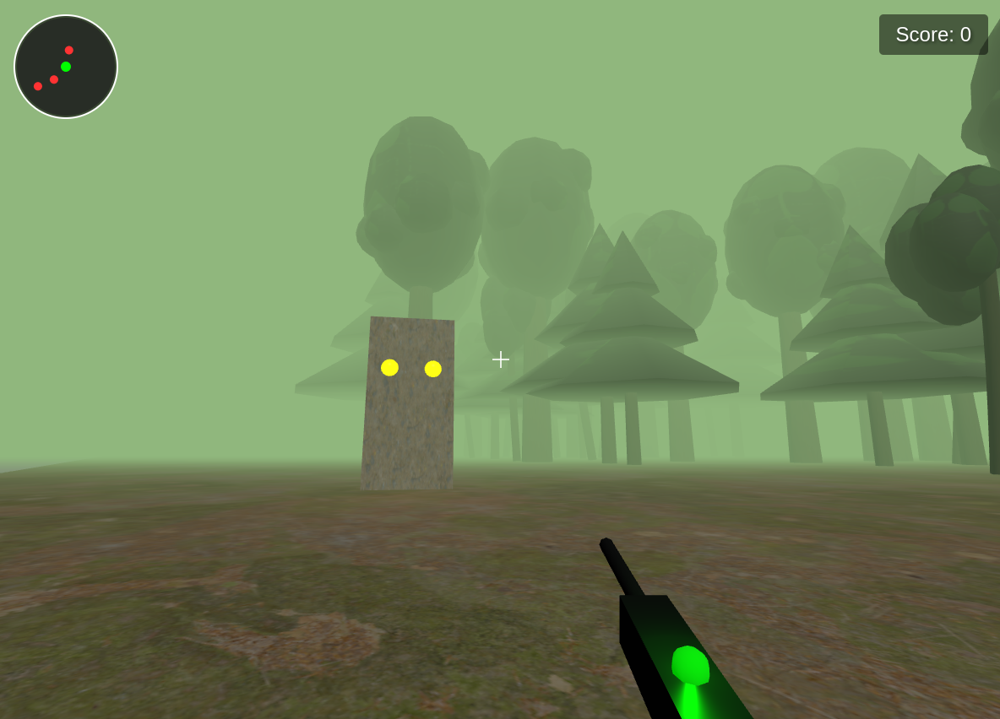

# 3D Shooter Game

A browser-based 3D shooter game built with Three.js. Survive as long as you can by shooting down enemies in a foggy forest!

---

## How to Play

- **Move:** Use arrow keys to move around.
- **Look:** Move your mouse to look around (click the game window to lock the pointer).
- **Shoot:** Left-click to shoot your weapon.
- **Score:** Each enemy you shoot increases your score by 1.
- **Radar:** The radar (top-left) shows enemy positions relative to you.
- **Game Over:** If an enemy gets too close, the game ends and your final score is displayed. Click "Retry" to play again.

---

## Features

- First-person movement and mouse look
- Visible weapon model with shooting effects and recoil
- Enemies with glowing eyes and lights that chase the player
- Radar system for enemy tracking
- Scoreboard (top-right) updates in real time
- Game over and retry system
- Ambient sounds and shooting/explosion effects

---

## Example Screencast

https://github.com/kasappeal/AI4Devs-videogame-RO-1/blob/main/3dshooter-ACC/screencast.mp4

## Example Screenshot

---

## Getting Started

1. **Clone or Download** this repository.
2. **Open `src/index.html`** in your web browser (no server required).
3. **Enjoy!**

---

## Controls

| Action      | Key/Mouse         |
|-------------|-------------------|
| Move        | W, A, S, D / Arrows |
| Look        | Mouse movement    |
| Shoot       | Left Mouse Button |
| Retry       | Click "Retry" after Game Over |

---

## Project Structure

- `src/` - Main source code (TypeScript, HTML, CSS)
- `assets/` - Sounds and textures
- `readme.md` - This documentation
- `screenshot.png` - Example gameplay image

---

## Credits

- Built with [Three.js](https://threejs.org/)
- Sound and textures: see `assets/` for attributions

---

Enjoy the game!
